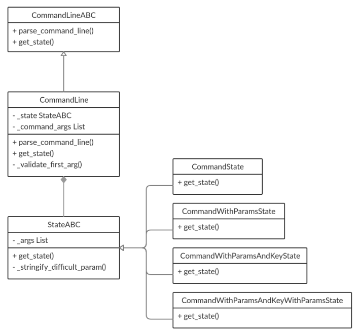

# command-line-state

## [OTUS](https://otus.ru) homework

### Goal
Implement OOP pattern **State**

### Description
The program gets command line and parses it 
then outputs the state of the program depending on command line args. 

### Class schema


### State
The program has **_state** property which contains object of **StateABC** implemented class.
Every child class of **StateABC** has its own implementation of **get_state** returning state of program.
```text
$ Enter command line: add
state: {'state': 'command', 'command': 'add'}

$ Enter command line: add param -c
state: {'state': 'command with params and key', 'command': 'add', 'command_params': 'param', 'key': '-c'}

$ Enter command line:
state: {'state': 'empty state'}
```
So **_state** property depends on command line and this property is being changed runtime.

To run program:
```bash
$ python start.py
```

To run tests:
```bash
$ python -m unittest tests
```